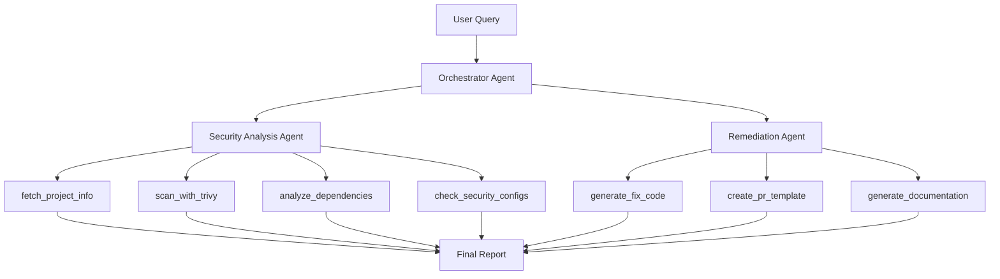

# 🔐 SecurityAgent Portfolio

**AI-Powered Security Vulnerability Analysis & Remediation System**

[](https://www.python.org/downloads/)
[](https://langchain.com/)
[](https://streamlit.io/)
[](https://opensource.org/licenses/MIT)

> Tool Calling 기반 Multi-Agent 시스템을 활용한 자동화된 보안 취약점 분석 및 수정 방안 생성 플랫폼

## 🎯 프로젝트 개요

SecurityAgent는 OpenRouter API와 LangChain을 활용하여 실제 프로젝트의 보안 취약점을 자동으로 탐지하고, 구체적인 수정 방안을 제시하는 AI 에이전트 시스템입니다. DevSecOps 워크플로우에 통합 가능한 실용적인 보안 자동화 솔루션을 제공합니다.

### ✨ 핵심 특징

- **🤖 Multi-Agent 협업**: 보안 분석과 수정 방안 생성을 전담하는 전문 에이전트들
- **🔧 13개 Tool Chaining**: Trivy, 정적 분석, 수정 코드 생성, GitHub PR 자동 생성 등
- **🚀 GitHub 자동 PR**: 분석 후 실제 GitHub에 Pull Request 자동 생성 (GitHub CLI 연동)
- **📊 실시간 웹 UI**: Streamlit 기반 대시보드와 성능 모니터링
- **📈 성능 추적**: Tool 호출 시간, 토큰 사용량, 성공률 등 상세 메트릭
- **🎯 실제 취약점**: 의도적으로 생성된 취약한 데모 프로젝트로 End-to-End 시연

## 🏗️ 아키텍처



### 🛠️ Tool Calling Flow

**보안 분석 Tools:**
1. **fetch_project_info**: 프로젝트 메타데이터 수집
2. **scan_with_trivy**: 실제 Trivy를 통한 취약점 스캔
3. **analyze_dependencies**: CVE 데이터베이스 기반 종속성 분석
4. **check_security_configs**: 정적 코드 분석 (SAST)
5. **calculate_priority_score**: CVSS 기반 우선순위 계산

**수정 방안 Tools:**
6. **generate_fix_code**: 취약점별 구체적 수정 코드 생성
7. **create_pr_template**: GitHub PR 템플릿 자동 생성
8. **generate_security_documentation**: 보안 문서 자동 생성
9. **generate_fix_script**: 자동화 스크립트 생성

**GitHub 연동 Tools:**
10. **create_github_pr**: ⭐ GitHub에 실제 PR 자동 생성 (NEW!)
11. **create_github_issue**: GitHub Issue 자동 생성

**분석 Tools:**
12. **analyze_vulnerability_trends**: 취약점 트렌드 분석
13. **generate_security_metrics**: 보안 메트릭 계산

## 🚀 빠른 시작

### 1. 설치

```bash
git clone https://github.com/your-username/security-agent-portfolio.git
cd security-agent-portfolio
pip install -r requirements.txt
```

### 1.5 GitHub CLI 설치 (선택사항 - PR 자동 생성용)

**자동 PR 생성 기능을 사용하려면:**

```bash
# macOS
brew install gh

# Ubuntu/Debian
sudo apt install gh

# Windows
winget install --id GitHub.cli

# 인증
gh auth login
```

> 💡 **GitHub CLI 없이도** PR 템플릿 생성까지는 사용 가능합니다!

### 2. 환경 설정

```bash
cp .env.example .env
# .env 파일에서 API 키 설정
```

**필수 환경 변수:**
```bash
OPENROUTER_API_KEY=your_openrouter_api_key_here
MODEL_NAME=openai/gpt-4-turbo-preview
TEMPERATURE=0.3
MAX_TOKENS=4096
```

### 3. 데모 실행

```bash
# Streamlit UI 실행
streamlit run streamlit_app.py

# 또는 CLI로 직접 실행
python -c "
import asyncio
from src.agents.orchestrator_agent import SecurityOrchestrator

async def main():
    orchestrator = SecurityOrchestrator()
    result = await orchestrator.analyze_and_remediate(
        'demo/hello-world-vulnerable',
        'Comprehensive security analysis'
    )
    print(orchestrator._get_workflow_summary())

asyncio.run(main())
"
```

### 4. 취약점 데모 확인

포함된 `demo/hello-world-vulnerable` 프로젝트는 다음 취약점들을 포함합니다:

- **SQL Injection** (Critical): f-string을 통한 쿼리 생성
- **XSS** (High): 사용자 입력 직접 렌더링
- **하드코딩된 시크릿** (High): API 키, 비밀번호 등
- **Command Injection** (Critical): subprocess shell=True 사용
- **의존성 취약점**: Flask 1.0.0, PyYAML 3.13 등 EOL 패키지

## 📊 예상 실행 결과

```
🔒 보안 분석 완료

📊 요약:
- 총 취약점: 15개
- Critical: 4개
- High: 6개
- Medium: 3개
- Low: 2개

⏱️ 분석 시간: 8.3초
🔧 사용된 도구: 7개

🚨 즉시 조치 필요!

🔧 수정 방안 생성 완료

📋 생성된 수정사항:
- 취약점 수정 코드: 8개
- PR 템플릿: ✅
- 보안 문서: ✅
- 자동 수정 스크립트: ✅

⏱️ 예상 수정 시간: 12.5시간 (1.6일)
```

## 🎯 Tool Calling 데모

### 실제 Tool 체이닝 예시

```python
# 1. 프로젝트 정보 수집
project_info = await fetch_project_info("demo/hello-world-vulnerable")
# → {"language": "Python", "framework": "Flask", "files": [...]}

# 2. Trivy 스캔 실행
trivy_results = await scan_with_trivy("demo/hello-world-vulnerable")
# → 15개 CVE 발견

# 3. 정적 분석
security_issues = await check_security_configs("demo/hello-world-vulnerable")
# → SQL Injection, XSS, 하드코딩된 시크릿 발견

# 4. 수정 코드 생성
for vulnerability in vulnerabilities:
    fix_code = await generate_fix_code(vulnerability)
    # → 구체적인 before/after 코드 제공

# 5. PR 템플릿 생성
pr_template = await create_pr_template(vulnerabilities)
# → GitHub PR용 마크다운 템플릿 생성
```

## 💡 핵심 구현 기법

### Multi-Agent 협업

```python
class SecurityOrchestrator:
    async def analyze_and_remediate(self, project_path, query):
        # Phase 1: 보안 분석
        security_analysis = await self.security_agent.analyze_project(project_path)

        # Phase 2: 수정 방안 생성
        remediation_plan = await self.remediation_agent.generate_remediation_plan(
            security_analysis
        )

        # Phase 3: 종합 리포트
        final_report = await self._generate_final_report(
            security_analysis, remediation_plan
        )

        return comprehensive_results
```

### Tool Calling with LangChain

```python
@tool
def scan_with_trivy(target_path: str) -> Dict[str, Any]:
    """Trivy를 사용하여 실제 취약점 스캔"""
    try:
        # 실제 Trivy 실행
        result = subprocess.run([
            'trivy', 'fs', target_path, '--format', 'json'
        ], capture_output=True, timeout=60)

        return json.loads(result.stdout)
    except FileNotFoundError:
        # Trivy 없을 시 모의 데이터 반환
        return generate_mock_trivy_results()
```

### 성능 추적

```python
class PerformanceTracker:
    def track_tool_call(self, tool_name: str):
        def decorator(func):
            @wraps(func)
            def wrapper(*args, **kwargs):
                start_time = time.time()
                try:
                    result = func(*args, **kwargs)
                    self.log_success(tool_name, time.time() - start_time)
                    return result
                except Exception as e:
                    self.log_error(tool_name, str(e))
                    raise
            return wrapper
        return decorator
```

## 🧪 테스트

```bash
# 전체 테스트 실행
pytest

# 특정 테스트만 실행
pytest tests/test_tools.py -v
pytest tests/test_agents.py -v

# 커버리지 포함
pytest --cov=src tests/
```

### 테스트 구조

- **단위 테스트**: 각 Tool의 개별 기능 검증
- **통합 테스트**: Agent 간 데이터 플로우 검증
- **End-to-End 테스트**: 전체 워크플로우 시나리오

## 📈 성능 메트릭

### 측정 항목

- **Tool 호출 시간**: 각 도구별 평균 응답 시간
- **성공률**: Tool 호출 성공/실패 비율
- **토큰 사용량**: LLM API 호출별 토큰 소비량
- **메모리 사용량**: 대용량 프로젝트 분석 시 리소스 사용량

### 실시간 모니터링

```python
# Streamlit 대시보드에서 실시간 확인
performance_report = tracker.get_performance_report()
alerts = alert_manager.check_alerts()

# 성능 임계값 초과 시 자동 알림
if avg_response_time > 10.0:
    alert_manager.send_alert("Performance degradation detected")
```

## 🔧 확장 가능성

### 새로운 Tool 추가

```python
@tool
def scan_with_semgrep(project_path: str) -> Dict[str, Any]:
    """Semgrep 정적 분석 도구 통합"""
    # 구현...

# Agent에 자동으로 등록됨
security_agent.analysis_tools.append(scan_with_semgrep)
```

### 커스텀 Agent 생성

```python
class ComplianceAgent(BaseAgent):
    """컴플라이언스 전문 에이전트"""

    def __init__(self):
        self.tools = [
            check_gdpr_compliance,
            validate_pci_dss,
            generate_audit_report
        ]
```

## 📋 프로젝트 구조

```
security-agent-portfolio/
├── src/
│   ├── agents/              # Multi-Agent 시스템
│   │   ├── security_agent.py
│   │   ├── remediation_agent.py
│   │   └── orchestrator_agent.py
│   ├── tools/               # Tool Calling 구현
│   │   ├── scanner_tools.py
│   │   ├── analysis_tools.py
│   │   └── fix_tools.py
│   ├── models/              # LLM 설정
│   │   └── llm_config.py
│   └── utils/               # 유틸리티
│       ├── performance.py
│       └── logger.py
├── demo/
│   └── hello-world-vulnerable/  # 취약점 데모
├── tests/                   # 테스트 코드
├── streamlit_app.py         # 웹 UI
└── requirements.txt
```

## 🔍 실제 사용 시나리오

### DevSecOps 파이프라인 통합

```yaml
# GitHub Actions 예시
- name: Security Analysis
  run: |
    python -c "
    import asyncio
    from src.agents.orchestrator_agent import SecurityOrchestrator

    async def main():
        orchestrator = SecurityOrchestrator()
        result = await orchestrator.analyze_and_remediate('.')

        if result['final_report']['security_posture']['risk_level'] == 'CRITICAL':
            exit(1)  # 빌드 실패

    asyncio.run(main())
    "
```

### 정기 보안 스캔

```python
# 크론잡으로 정기 실행
@schedule.every().day.at("02:00")
def daily_security_scan():
    projects = get_monitored_projects()

    for project in projects:
        orchestrator = SecurityOrchestrator()
        result = await orchestrator.analyze_and_remediate(project.path)

        if has_new_critical_vulnerabilities(result):
            send_alert_to_security_team(result)
```

## 🎯 포트폴리오 시연 포인트

### 1. **Tool Calling 마스터리**
- 7개 이상의 복잡한 Tool 체이닝
- 실제 외부 도구(Trivy) 통합
- 에러 처리 및 Fallback 메커니즘

### 2. **Multi-Agent 아키텍처**
- 역할별 전문 에이전트 분리
- 비동기 에이전트 협업
- 상태 관리 및 데이터 플로우

### 3. **실무 적용 가능성**
- 실제 CVE 데이터베이스 활용
- GitHub PR 템플릿 자동 생성
- DevSecOps 파이프라인 통합 가능

### 4. **성능 최적화**
- 실시간 성능 모니터링
- 토큰 사용량 최적화
- 병렬 처리 및 캐싱

### 5. **사용자 경험**
- 직관적인 Streamlit UI
- 실시간 진행 상황 표시
- 상세한 분석 리포트

## 🤝 기여하기

1. Fork the repository
2. Create feature branch (`git checkout -b feature/amazing-feature`)
3. Commit changes (`git commit -m 'Add amazing feature'`)
4. Push to branch (`git push origin feature/amazing-feature`)
5. Open Pull Request

## 📝 라이선스

MIT License - 자세한 내용은 [LICENSE](LICENSE) 파일을 참조하세요.

## 🙋‍♂️ 문의사항

프로젝트 관련 질문이나 제안사항이 있으시면 이슈를 생성해 주세요.

---

**⭐ 이 프로젝트가 도움이 되셨다면 Star를 눌러주세요!**

> 이 프로젝트는 크래프톤의 "Agentic System을 활용한 창의적이고 혁신적인 솔루션" 미션에 부합하는 Tool Calling 기반 AI 에이전트 시스템을 구현한 포트폴리오입니다.